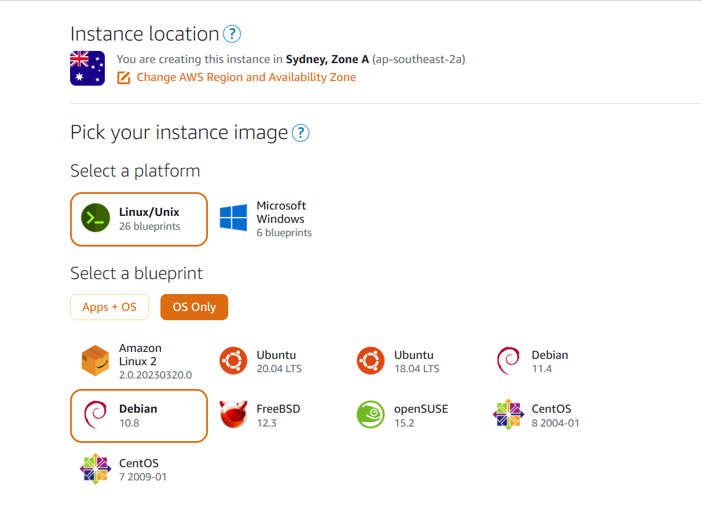
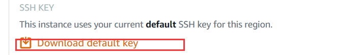
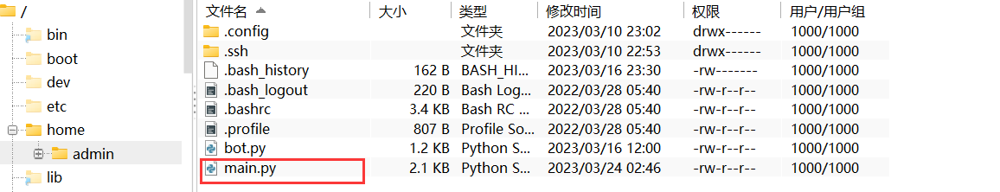
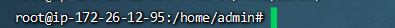
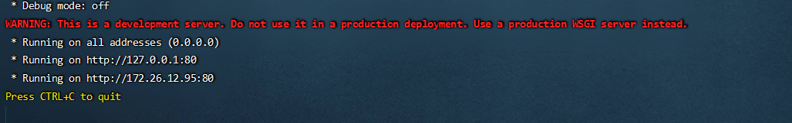
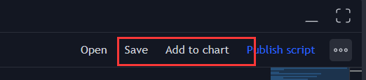
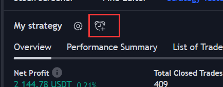
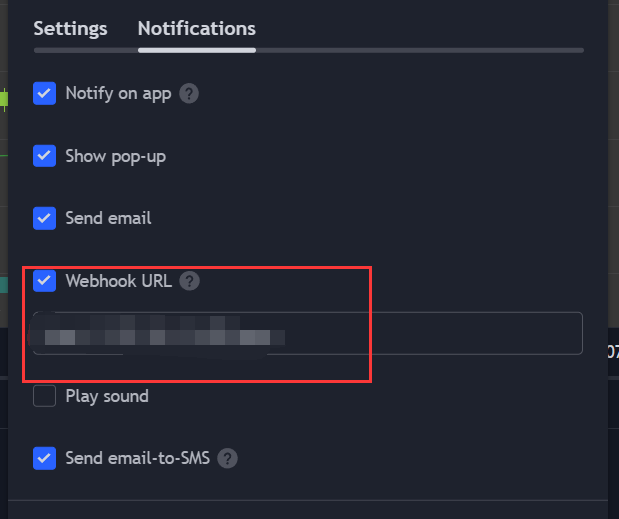
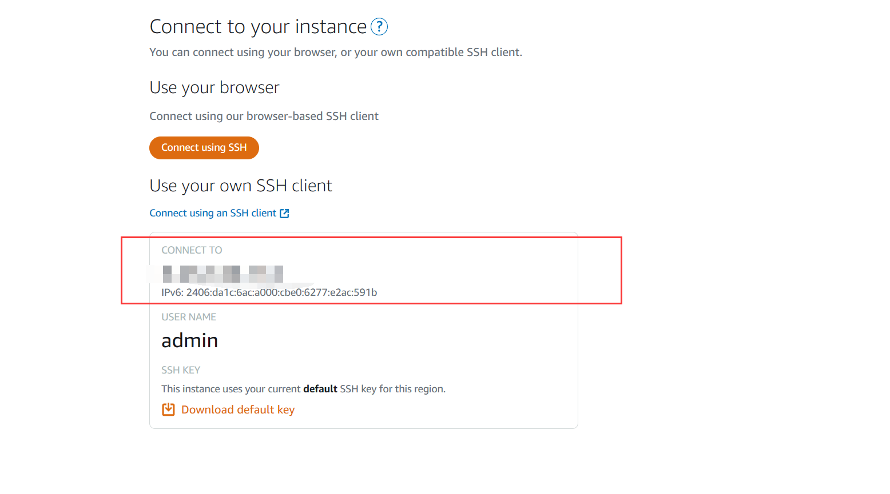

## Introduction
These are the steps to show how to build you own trading bot.

### workflow

1. [TradingView](https://cn.tradingview.com/)  send the signals to the server
2. The `main.py` receives the signals from `tradingview`
3. The `main.py` place the market orders to the exchange (I'm using bybit)

============================================================================

### preparation
### Server
1. Download `Finallshell` 
2. Go to Amazon Lightsail to buy a server
3. This is the settings. Keep the rest as default ($5 is good enough) 
4. After created an instance you will see your server is on the dashboard, wait until it changed to `Running` 
5. After we click on it, scroll down to download the `default key` and save it anywhere you like 
6. Then would be good to search how to connect to your server with `Finalshell`
7. After all, we need to run few commands to set up the server env
   `sudo su - root`
   `sudo apt update`
   `sudo apt install python3-pip`,
   `pip3 --version`
   `apt-get install screen`
   `pip3 install flask`
   `pip3 install ccxt`
8. Put the `main.py` to this directory 
9. run `sudo su - root` `cd ../home/admin` `screen` then press space twice
10. Make sure you are still a root user also under admin directory
11. Run `python3 main.py` 

### TradingView 
1. Sign up an account
2. Search for any product you want. ( I used `ETH/USDT` to [demonstrate](https://cn.tradingview.com/symbols/ETHUSDT.P/ideas/?exchange=BITGET))
3. Open its kindle graph, at the bottom open the `pine Editor`
4. Right click the editor to create a new strategy
5. Click `save` then `Add to chart`
    
6. Click on the icon 
   
7. Paste this msg to `message` block
    ``{"side":"{{strategy.order.action}}",
    "symbol":"{{ticker}}",
    "amount":"{{strategy.order.contracts}}",
    "point":"0"}
   ``

### Pick your exchange
1. Grap the api key from your exchange
2. Replace the api key info in `main.py`
3. Read the api documentation of the exchange you chose

### Connection of all things
1. Update the alert on tradingview, change the webHook URL to your server url 
2. Once there's signal, tradingview will send it to the destination (url) then the server will place order for you
3. Where to find the url ? 
4. For instance: http://0.0.0.0:80/open, 80 is port number when you set up your server, `open` is the restApi format which reflect the `main.py` at line 67
5. Done